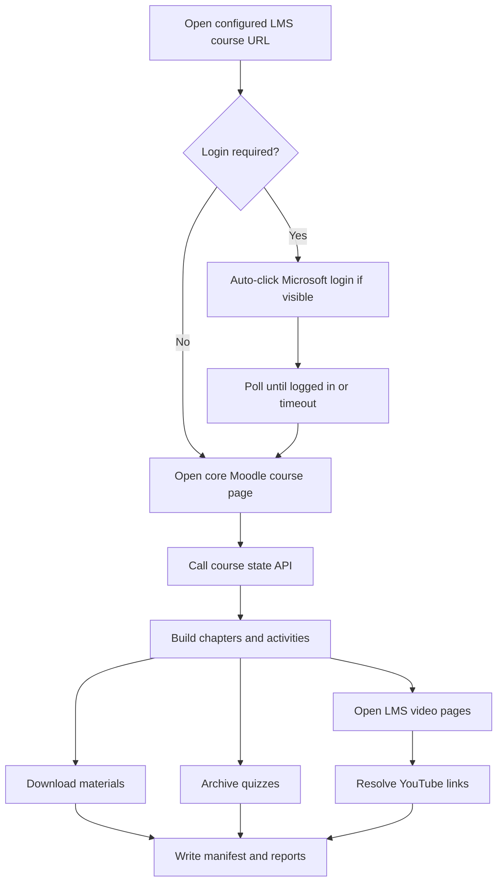

<a id="readme-top"></a>

<div align="center">

# CSDL Study Pack Extractor

**A local Playwright automation toolkit for archiving UTC LMS course materials, quizzes, and video links into a clean offline study pack.**

[](https://nodejs.org/)
[](https://playwright.dev/)
[](https://www.microsoft.com/windows)
[](#roadmap)

[Quick Start](#quick-start) · [Configuration](#configuration) · [Output](#output-structure) · [Troubleshooting](#troubleshooting)

</div>

---

## Table of Contents

- [About The Project](#about-the-project)
- [Built With](#built-with)
- [Getting Started](#getting-started)
  - [Prerequisites](#prerequisites)
  - [Installation](#installation)
- [Quick Start](#quick-start)
- [Usage](#usage)
- [Configuration](#configuration)
- [Output Structure](#output-structure)
- [How It Works](#how-it-works)
- [Troubleshooting](#troubleshooting)
- [Roadmap](#roadmap)
- [Security & Privacy](#security--privacy)
- [Repository Hygiene](#repository-hygiene)
- [Acknowledgments](#acknowledgments)

---

## About The Project

CSDL Study Pack Extractor is a local browser automation tool for collecting study resources from the UTC LMS course page. It was designed for the modern LMS flow where course content can be rendered through a SPA frontend while the real course structure is loaded from Moodle-style API responses.

The extractor converts a live course page into an organized offline pack:

- Course files and resources are saved into `materials/`.
- Quiz pages are archived as HTML, PDF, Markdown, and JSON.
- LMS video pages are opened and resolved to real YouTube links when possible.
- A browsable offline index and extraction report are generated in `exports/`.

<p align="right">(<a href="#readme-top">back to top</a>)</p>

---

## Built With

- [Node.js](https://nodejs.org/) — runtime for the extractor scripts.
- [Playwright](https://playwright.dev/) — browser automation with persistent Chrome profile support.
- [Google Chrome](https://www.google.com/chrome/) — visible browser channel for LMS login and debugging.
- Markdown / HTML / PDF exports — portable offline study outputs.

<p align="right">(<a href="#readme-top">back to top</a>)</p>

---

## Getting Started

### Prerequisites

Install these before running the project:

- Windows 10/11
- Node.js 18+ recommended, Node.js 20+ preferred
- Google Chrome
- A valid UTC LMS account

Check Node.js:

```powershell
node --version
npm --version
```

### Installation

Clone the repository, then install dependencies inside the `code` folder:

```powershell
Set-Location "d:\Nam 2(D)\ToolCSDL\Database_Study_Pack\code"
npm install
npm run setup
```

`npm run setup` installs the Playwright Chrome browser integration required by the automation scripts.

<p align="right">(<a href="#readme-top">back to top</a>)</p>

---

## Quick Start

### Option 1 — One-click Windows launcher

Double-click this file:

```text
Database_Study_Pack\run_extractor.bat
```

The launcher will:

1. Move into the correct `code` directory.
2. Run syntax validation.
3. Start the extractor.
4. Keep the terminal open so you can inspect logs.

### Option 2 — Terminal commands

```powershell
Set-Location "d:\Nam 2(D)\ToolCSDL\Database_Study_Pack\code"
npm run check
npm run extract
```

> [!IMPORTANT]
> Running `npm run check` from `d:\Nam 2(D)\ToolCSDL` will fail because that folder does not contain `package.json`. Always run commands from `Database_Study_Pack\code` or use `run_extractor.bat`.

<p align="right">(<a href="#readme-top">back to top</a>)</p>

---

## Usage

### Validate source files

```powershell
npm run check
```

### Save or refresh login session

```powershell
npm run login
```

Use this when the session expires or the LMS asks you to authenticate again.

### Run extraction

```powershell
npm run extract
```

Current extraction behavior:

- Opens the configured course URL.
- Detects the login page.
- Clicks Microsoft / Office 365 login when visible.
- Waits up to `loginWaitSeconds` seconds.
- Continues immediately when login is detected.
- Opens the Moodle core course page when needed.
- Reads course sections from `core_courseformat_get_state`.
- Downloads or archives materials, quizzes, and videos.

### Regenerate reports from existing manifest

```powershell
npm run report
```

Use this after editing report generation logic or when you already have `exports/manifest.json`.

<p align="right">(<a href="#readme-top">back to top</a>)</p>

---

## Configuration

Runtime settings live in:

```text
code/config.local.json
```

Example:

```json
{
  "courseUrl": "https://lms.utc.edu.vn/course/11146/view",
  "headlessExtraction": false,
  "timeoutMs": 120000,
  "maxItemsPerChapter": 0,
  "keepBrowserOpenAfterExtract": true,
  "loginWaitSeconds": 10
}
```

| Option | Purpose | Typical Value |
| --- | --- | --- |
| `courseUrl` | Target LMS course page | `https://lms.utc.edu.vn/course/11146/view` |
| `headlessExtraction` | Show or hide Chrome during extraction | `false` for debugging |
| `timeoutMs` | Navigation/action timeout | `120000` |
| `maxItemsPerChapter` | Limit extracted items per chapter | `0` means no limit |
| `keepBrowserOpenAfterExtract` | Keep Chrome open after completion/error | `true` while testing |
| `loginWaitSeconds` | Max login polling time | `10` |

> [!NOTE]
> `config.local.json` is ignored by Git because it is machine-specific runtime configuration.

<p align="right">(<a href="#readme-top">back to top</a>)</p>

---

## Output Structure

```text
Database_Study_Pack/
├── code/                     # Node.js automation source
│   ├── src/                  # Extractor, login, report modules
│   ├── scripts/              # Syntax validation scripts
│   └── package.json          # npm scripts and dependencies
├── browser-profile/          # Local persistent Chrome session, ignored by Git
├── materials/                # Downloaded course resources, ignored by Git
├── quizzes/                  # Archived quiz outputs, ignored by Git
│   ├── html/
│   ├── pdf/
│   ├── markdown/
│   └── json/
├── videos/                   # Resolved video list, ignored by Git
│   └── videos.md
├── exports/                  # Manifest, report, index, debug snapshots, ignored by Git
│   ├── manifest.json
│   ├── extraction-report.md
│   ├── index.html
│   ├── debug-page.html
│   └── debug-page.txt
└── run_extractor.bat         # Windows one-click launcher
```

Generated study files are intentionally excluded from Git to keep the repository clean and avoid committing private LMS content.

<p align="right">(<a href="#readme-top">back to top</a>)</p>

---

## How It Works



The important implementation detail is that the extractor does not rely only on static DOM scraping. It uses the Moodle course state API when available, which is more reliable for SPA-rendered LMS pages.

<p align="right">(<a href="#readme-top">back to top</a>)</p>

---

## Troubleshooting

### `Could not read package.json`

You are running npm from the wrong directory.

Correct:

```powershell
Set-Location "d:\Nam 2(D)\ToolCSDL\Database_Study_Pack\code"
npm run check
```

Or use:

```text
run_extractor.bat
```

### Chrome opens then closes or profile is locked

Close all Chrome windows started by the tool, then run again. The persistent profile is stored in:

```text
browser-profile/
```

### Login does not continue automatically

Try these steps:

1. Set `headlessExtraction` to `false`.
2. Set `keepBrowserOpenAfterExtract` to `true`.
3. Run `npm run login` once.
4. Run `npm run extract` again.

### Video links still point to LMS pages

Some LMS pages may not expose a YouTube URL until the embedded player loads. Keep `headlessExtraction` disabled and re-run extraction so the resolver can inspect iframe and page HTML.

<p align="right">(<a href="#readme-top">back to top</a>)</p>

---

## Roadmap

- [x] Persistent browser session for LMS login.
- [x] Automatic Microsoft login button detection.
- [x] Moodle course state API discovery.
- [x] Offline materials, quiz, and video report generation.
- [x] YouTube URL resolution from LMS video pages.
- [x] Windows one-click launcher.
- [ ] More detailed progress logging per chapter.
- [ ] Safer retry strategy for interrupted Chrome sessions.
- [ ] Optional export profile for multiple courses.

<p align="right">(<a href="#readme-top">back to top</a>)</p>

---

## Security & Privacy

- The tool does not store your LMS password.
- Browser session data is stored locally in `browser-profile/`.
- Runtime config and generated course content are ignored by Git.
- Do not commit private course materials, cookies, HAR files, or exported quiz data.

> [!CAUTION]
> This project is intended for personal academic archiving. Respect LMS policies, course ownership, and copyright rules.

<p align="right">(<a href="#readme-top">back to top</a>)</p>

---

## Repository Hygiene

The repository keeps source code and reproducible scripts under version control while excluding local or private artifacts:

- Tracked: source code, README, launcher, validation scripts.
- Ignored: `node_modules`, browser profile, extracted course files, generated reports, local config.

Before pushing:

```powershell
Set-Location "d:\Nam 2(D)\ToolCSDL\Database_Study_Pack"
git status --short
```

<p align="right">(<a href="#readme-top">back to top</a>)</p>

---

## Acknowledgments

- README structure inspired by [Best-README-Template](https://github.com/othneildrew/Best-README-Template).
- Built with [Playwright](https://playwright.dev/).
- Created for local study workflow automation.

<p align="right">(<a href="#readme-top">back to top</a>)</p>
